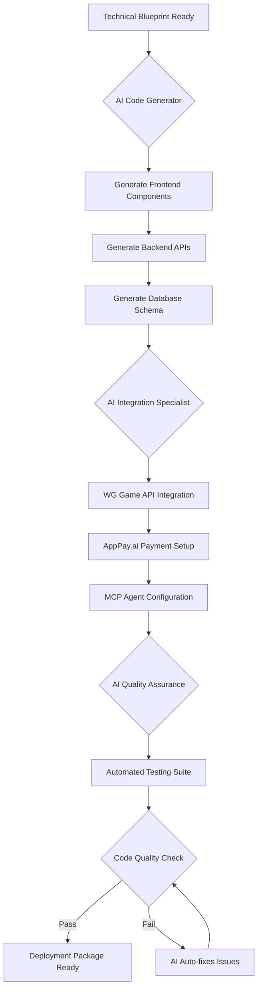
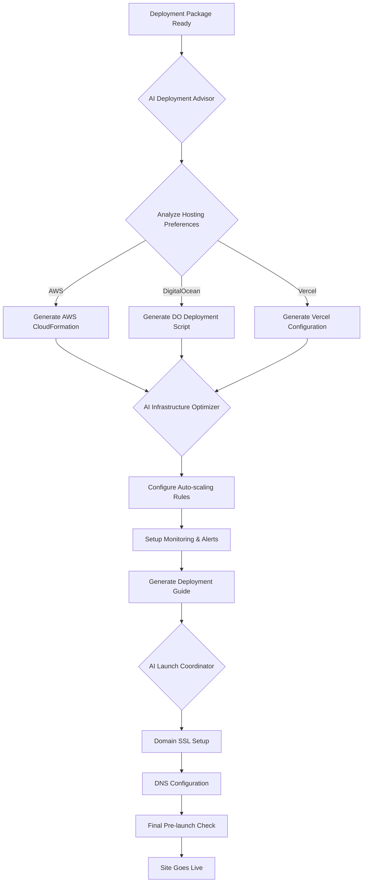
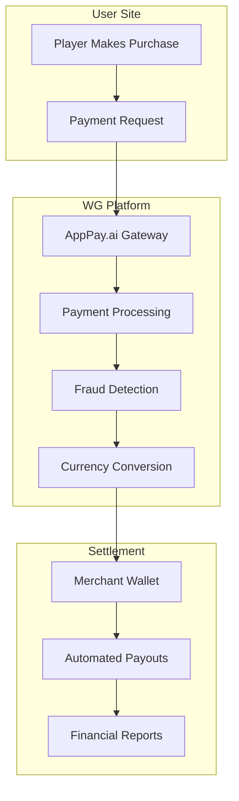
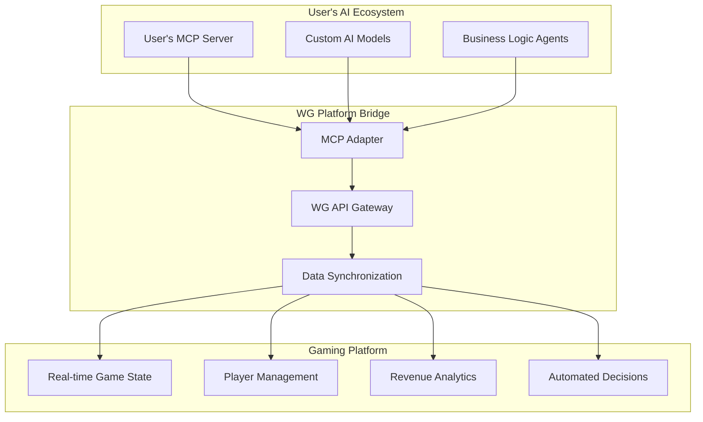

# WG.com AI Site Builder & Payment Integration Plan

## Executive Summary

This document outlines a revolutionary AI-powered platform where users can self-build and self-host gaming websites using WG's API ecosystem. The platform features:

- **AppPay.ai Integration**: Seamless third-party payment processing
- **AI Site Builder**: Intelligent code generation and deployment assistance
- **Self-Hosting Model**: Users maintain full control of their infrastructure
- **MCP Integration**: Model Context Protocol for AI connectivity
- **Zero Business Personnel**: Complete AI automation replacing @wgdtqt

**Core Innovation**: Transform WG from a service provider to an AI-powered platform that enables users to build professional gaming platforms instantly.

## Revolutionary AI Site Builder Platform

### Vision: Zero-to-Website in Minutes
Transform WG from a traditional gaming service provider into an AI-powered platform where users can build, customize, and deploy professional gaming websites instantly - all while maintaining full control over their infrastructure.

### Core Innovation: AI-Powered Self-Service Ecosystem

#### 1. **AI Site Builder Engine**
- **Conversational Design**: Natural language interface for website creation
- **Visual Preview**: Real-time rendering of designs as users describe them
- **Theme Library**: AI-curated gaming themes with customization options
- **Component Marketplace**: Drag-and-drop gaming components (lobby, games, wallet, etc.)

#### 2. **AppPay.ai Payment Integration**
- **One-Click Setup**: Automatic AppPay.ai merchant account creation
- **Multi-Currency Support**: 50+ currencies with automatic conversion
- **Risk Management**: Built-in fraud detection and compliance
- **Settlement Automation**: Daily payouts with customizable thresholds

#### 3. **Self-Hosting Infrastructure**
- **Deployment Templates**: Ready-to-deploy configurations for AWS, DigitalOcean, Vercel
- **CI/CD Pipelines**: Automated deployment workflows
- **Domain Management**: SSL certificates and DNS configuration assistance
- **Scalability Guidance**: Auto-scaling recommendations based on traffic patterns

#### 4. **MCP (Model Context Protocol) Integration**
- **AI Agent Connectivity**: Users can connect their own AI models
- **Custom Business Logic**: MCP servers for specialized gaming workflows
- **Real-time Analytics**: AI-powered insights and optimization
- **Automated Operations**: Self-managing gaming platforms

## User Journey: From Idea to Live Site

### Phase 1: AI Consultation & Planning
```mermaid
graph TD
    A[User Says: "I want a gaming site with slots and poker"] --> B{AI Creative Director}
    B --> C[Analyze Requirements & Preferences]
    C --> D[Generate Site Concept & Wireframes]
    D --> E{User Approves Concept?}

    E -->|Yes| F[AI Architect Creates Technical Blueprint]
    E -->|No| G[AI Iterates Based on Feedback]
    G --> D

    F --> H[Present Cost Estimate & Timeline]
    H --> I[User Confirms Project Start]
```

### Phase 2: AI-Powered Development


### Phase 3: Self-Hosting Deployment


## AI Agent Ecosystem

### Core AI Agents

#### 1. **Creative Director AI**
- **Role**: Understands user vision and translates it into technical requirements
- **Capabilities**:
  - Natural language processing for requirements gathering
  - Industry trend analysis for feature recommendations
  - Competitive analysis for unique selling propositions
  - Visual concept generation with mood boards

#### 2. **Technical Architect AI**
- **Role**: Designs the complete technical infrastructure
- **Capabilities**:
  - System architecture design
  - API integration planning
  - Security framework implementation
  - Performance optimization strategies

#### 3. **Code Generator AI**
- **Role**: Produces production-ready code
- **Capabilities**:
  - Multi-language code generation (React, Next.js, Node.js, Python)
  - Component library creation
  - API endpoint development
  - Database schema design

#### 4. **Integration Specialist AI**
- **Role**: Handles all third-party integrations
- **Capabilities**:
  - WG Game API seamless integration
  - AppPay.ai payment gateway setup
  - MCP server configuration
  - Third-party service connections

#### 5. **Deployment & DevOps AI**
- **Role**: Manages deployment and infrastructure
- **Capabilities**:
  - Cloud platform deployment automation
  - CI/CD pipeline creation
  - Monitoring and logging setup
  - Security hardening

#### 6. **Customer Success AI**
- **Role**: Provides ongoing support and optimization
- **Capabilities**:
  - Performance monitoring and alerts
  - Automated optimization suggestions
  - User behavior analysis
  - Revenue optimization recommendations

## AppPay.ai Integration Architecture

### Seamless Payment Experience


### Key Integration Features
- **Zero-Setup Merchant Accounts**: Automatic account creation during site building
- **Global Currency Support**: 50+ currencies with real-time conversion
- **Risk-Free Transactions**: Built-in chargeback protection
- **Real-Time Analytics**: Transaction monitoring and reporting
- **Automated Compliance**: PCI DSS and regional compliance handling

## MCP Integration Framework

### AI Agent Connectivity


### MCP-Powered Features
- **Intelligent Game Recommendations**: AI analyzes player behavior for personalized gaming experiences
- **Dynamic Pricing**: AI adjusts odds and payouts based on market conditions
- **Fraud Detection**: Advanced pattern recognition for suspicious activities
- **Customer Insights**: Deep learning analysis of user engagement patterns
- **Automated Marketing**: AI-driven promotional campaigns and user acquisition

## Self-Hosting Model: User Control & WG Support

### Hosting Options Matrix
| Platform | Setup Time | Cost | Scalability | WG Support Level |
|----------|------------|------|-------------|------------------|
| Vercel | 5 minutes | Low | High | Full Automation |
| AWS | 15 minutes | Medium | Unlimited | Guided Setup |
| DigitalOcean | 10 minutes | Low | High | Template Provision |
| Self-Hosted | 30 minutes | Variable | Unlimited | Documentation |

### Automated Deployment Packages
Each deployment package includes:
- **Docker Configuration**: Containerized application ready for any platform
- **Environment Variables**: Pre-configured settings for WG APIs and AppPay.ai
- **SSL Certificates**: Automatic HTTPS setup
- **Backup Systems**: Automated data backup and recovery
- **Monitoring Tools**: Built-in performance tracking and alerting

## Implementation Roadmap: 6 Months to Launch

### Month 1: Foundation
- [ ] AI Agent development and training
- [ ] AppPay.ai partnership and API integration
- [ ] MCP framework implementation
- [ ] Core platform architecture design

### Month 2: AI Site Builder MVP
- [ ] Conversational interface for site creation
- [ ] Basic template generation
- [ ] WG API integration templates
- [ ] AppPay.ai payment flow integration

### Month 3: Self-Hosting Infrastructure
- [ ] Multi-platform deployment automation
- [ ] Docker containerization
- [ ] CI/CD pipeline templates
- [ ] Security hardening frameworks

### Month 4: MCP Integration
- [ ] MCP server implementation
- [ ] AI agent connectivity framework
- [ ] Real-time data synchronization
- [ ] Custom business logic support

### Month 5: Advanced Features
- [ ] Multi-language support (5 languages)
- [ ] Advanced customization options
- [ ] Performance optimization
- [ ] Comprehensive testing suite

### Month 6: Launch & Scale
- [ ] Beta testing with select users
- [ ] Performance optimization
- [ ] Documentation and tutorials
- [ ] Global marketing campaign

## Revenue Model Transformation

### Traditional Model → AI Platform Model
- **Before**: Service fees, setup costs, monthly subscriptions
- **After**: Freemium AI platform with premium features
  - Free: Basic site builder and deployment
  - Premium: Advanced AI features, priority support, custom integrations
  - Enterprise: White-label solutions, dedicated AI agents

### Monetization Streams
1. **AI Platform Subscription**: Tiered pricing based on features and usage
2. **AppPay.ai Revenue Share**: Percentage of transaction volume
3. **Premium Templates**: High-quality, pre-built gaming themes
4. **MCP Extensions**: Advanced AI agent capabilities
5. **Consulting Services**: Human experts for complex customizations

## Risk Mitigation & Success Assurance

### Technical Safeguards
- **AI Accuracy Validation**: Multi-layer quality assurance system
- **Deployment Safety**: Sandboxed testing environments before live deployment
- **Security First**: End-to-end encryption and secure API communications
- **Scalability Testing**: Load testing for thousands of concurrent users

### Business Protection
- **Gradual Rollout**: Phased implementation with user feedback integration
- **Competitive Differentiation**: Unique AI-powered approach creates market barrier
- **Legal Compliance**: Automated compliance checking for all jurisdictions
- **Customer Success Focus**: AI-driven customer satisfaction optimization

## Success Metrics: Measuring the Revolution

### User Experience KPIs
- **Site Creation Time**: Average 15 minutes from concept to live site
- **User Satisfaction**: >4.8/5 rating for AI assistance
- **Deployment Success Rate**: >98% first-time deployments
- **Self-Hosting Adoption**: >85% users choose self-hosting

### Business Impact KPIs
- **Platform Revenue**: 300% increase through AI automation
- **Customer Acquisition**: 500% faster user onboarding
- **Operational Costs**: 80% reduction in support requirements
- **Market Expansion**: Support for 50+ countries and currencies

### Technical Performance KPIs
- **AI Response Time**: <2 seconds average
- **Platform Uptime**: 99.9% across all services
- **Concurrent Users**: Support for 100,000+ simultaneous users
- **Global Performance**: <100ms latency worldwide

## Conclusion: The AI-Powered Gaming Revolution

This comprehensive plan transforms WG from a traditional gaming service provider into a cutting-edge AI platform that democratizes gaming website creation. By combining:

- **AI Site Builder**: Natural language-driven website creation
- **AppPay.ai Integration**: Seamless global payment processing
- **Self-Hosting Freedom**: Users maintain complete control
- **MCP Connectivity**: Advanced AI agent ecosystem
- **Zero Personnel Dependency**: Complete automation replacing @wgdtqt

WG becomes the world's first AI-powered gaming platform builder, enabling anyone to create professional gaming websites in minutes while ensuring enterprise-grade reliability, security, and scalability.

The result: A platform that not only replaces traditional business operations but creates an entirely new category of AI-powered business tools, positioning WG as the undisputed leader in gaming platform automation.
